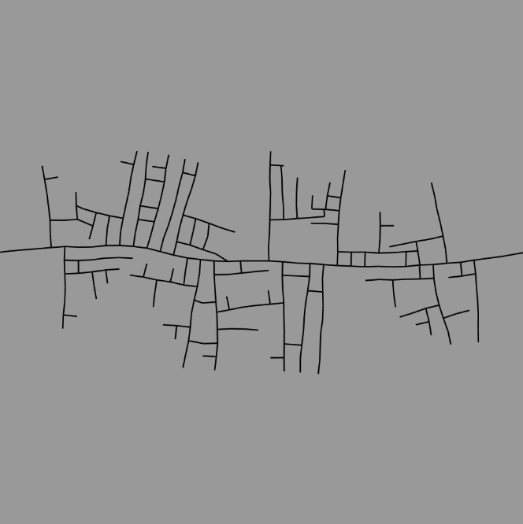
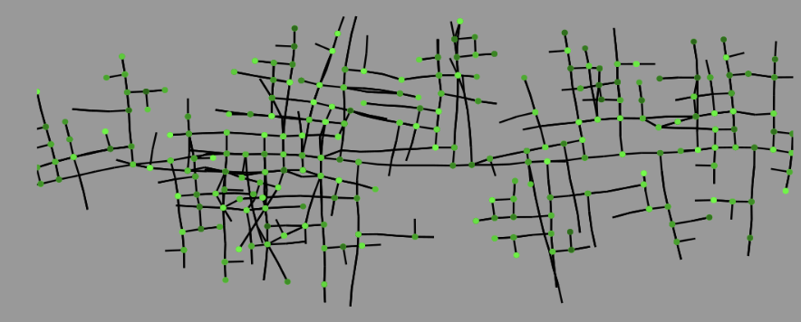

Dream Matrix
================
A tool made to procedurally generate cities and urban landscapes. In this project we use concepts from [this paper](https://cgl.ethz.ch/Downloads/Publications/Papers/2001/p_Par01.pdf) such as road generating l-systems in order to achieve the desired result. We implement this project in a Google Colab notebook using PyCairo to draw the maps. 

### Dependencies

* [PyCairo](https://pycairo.readthedocs.io/en/latest/)
* [Pillow](https://pillow.readthedocs.io/en/stable/)
* [Numpy](https://numpy.org/)

Pipeline Overview
================

As illustrated in the image above, the pipeline for this map generator goes through multiple steps. It starts with a road module which expands via the [l-system](https://en.wikipedia.org/wiki/L-system#:~:text=An%20L%2Dsystem%20consists%20of,generated%20strings%20into%20geometric%20structures.) we have in place. After generating the road segments and culling the roads that end up intersecting with others or are within a small radius of others, the road segments are stored in an [R-Tree data structure](https://en.wikipedia.org/wiki/R-tree#:~:text=The%20R%2Dtrees%20are%20tree,both%20theoretical%20and%20applied%20contexts.) designed for efficient retrieval so that if we wanted to check for intersections with other road segments, we could easily do that. After the map is generated, we encode it into a graph structure for functional use; for example, if we wanted to find a path between two points in the map.

For details on how the l-system works and how its structured, please see the paper referred to in the introduction.

Initial Attempts
================
To begin with, we implemented a rough version of the l-system specified in the paper, and we drew the road segments directly on a PyCairo canvas. The results were encouraging but had quite a few issues. 

|  |  |
| :------- | :-------: |

As you can see, the roads seemed to lack any structure, just randomly growing in all directions, but beyond that, the roads were intersecting themselves and each other which isn't feasible. To fix the former issue, we added a delay; the roads we start with had the smallest delay which means they expand every iteration whereas the branches had increasing delay in order to avoid interference between the main road and the branches.

R-Trees
================
We wanted to jump straight to collisions and resolve the issue, however, it would've been very inefficient to iterate through a list of road segments checking for collisions, so we had to implement the R-Tree structure which is a spatial data structure with the primary objective of making access to spatial data efficient; by reducing the number of entities I have to make comparisons with and sparing me the trouble of comparing my road segments with every other road segment.

| Road Structure | Node Structure |
| :------- | :-------: |
|  |  |

Here we have an image of the road structure and the (bounding boxes of the) R-Tree that contains it. The darker bounding boxes signify nodes higher up in the tree structure while the brightest ones would represent leaf nodes.

Collision Detection
================
After implementing R-Trees, we implemented two forms of collision detection; the first form of collision detection checks for intersections between two road segments. The second checks if the endpoint of the new road segment is within a radius of another road segment. Once we were able to implement those forms of collision detection, the difference in results was massive:

| | Before Collision Detection | After Collision Detection |
| :------- | :-------: | :------- |
| 1000 Iterations |  |  |
| 2000 Iterations |  |  |
| 10000 Iterations |  |  |

Path Finding
================
Finally, to add some functionality to our maps, we encoded the road structure into a graph structure with vertices and edges, and we implemented BFS to find the shortest path between any two points (or at least the closest road segments from those two points):

|  |  |  |
| :------- | :-------: | :-------: |

We've also shown that it's possible to have entities navigate from one point to the next through those paths:

|  |  |
| :------- | :-------: |

Future Directions
================
Although we've experienced a solid amount of success throughout this project, it's still just the beginning, and it's still in the prototype phase. There are a number of different ideas we have for the project going forward:

* I’d aim to optimise some of the processes (it currently takes 30 minutes to generate an entire map, granted, that's partially because we're running on Python but we think it's possible to improve).

* A way to save the map data (a file format).

* Ways to incorporate environmental factors such as terrain and population density.

* Additional methods of generating maps such as tensor fields.

* Methods of making the maps 3-dimensional.

* Transform the project from a prototype to a fully functioning standalone tool or plugin for various 3D software packages.

